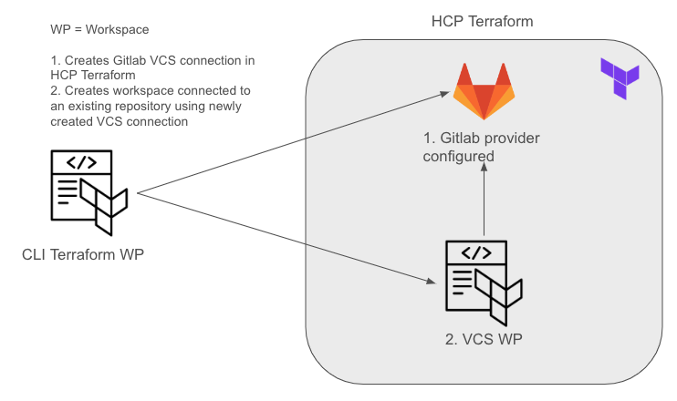

# Oauth
This repository aims to create a VCS connection in HCP Terraform and a workspace that will use the newly created VCS connection. 

It is executed in **remote** mode from an existing workspace called Oauth under your organization using the cloud block.

This example uses a gitlab_hosted account. If you use an enterprise edition you should use **gitlab_enterprise_edition** as the service_provider value on the tfe_oauth_client resource. 
For reference -> https://registry.terraform.io/providers/hashicorp/tfe/latest/docs/resources/oauth_client

## Prerequisites
`oauth_token` terraform variable -> Personal Access Token from the VCS provider (Github in this case)

`TFE_TOKEN` env variable -> Token to athenticate againts HCP Terraform to create the org/workspace and the VCS connection.

`<github-username>/Oauth` repository created -> This is the repository where the created workspace will be attached to using the VCS connection.

